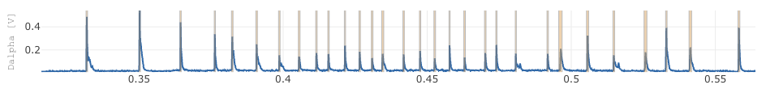
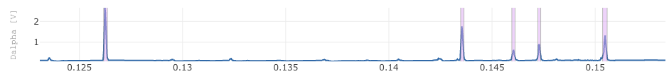
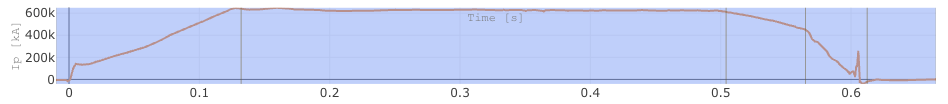
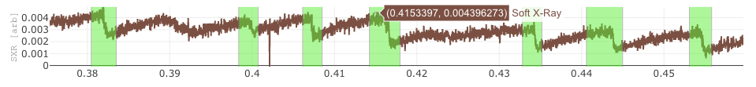

# Annotators
Annotators are interactive tools that enable you to quickly identify and label points of interest within a sample. They require some user interaction, such as setting a threshold or range, but are often much faster than manual data annotation.

## Peak Detection

<figure markdown="span">
   
  <figcaption>Peak detection being used to find the ELM peaks from the Dalpha signal.</figcaption>
</figure>

Peak detection identifies local maxima (peaks) in time series data. It is useful for highlighting significant events or anomalies in time series data where the value sharply increases compared to its neighbors.

### Parameters

- **signal_name**: Name of the signal to apply peak detection too.
- **prominence**: Minimum required prominence for a peak to be detected.
- **distance**: Minimum separation between detected peaks.
- **time_min**: Minimum time to consider valid for identifying peaks 
- **time_max**: Maximum time to consider valid for identifying peaks 

### Output

Returns a list of time regions centered on the peak. The size of the time region will be based on the size of the peak

## Outlier Detection

<figure markdown="span">
   
  <figcaption>MAD outlier detection being used to find outlier points in a time series signal.</figcaption>
</figure>

Outlier detection identifies and annotates anomalous values within a dataset. We offer two methods: Mean Absolute Deviation (MAD) and Isolation Forest.

 - MAD is a statistical method that identifies outliers based on the mean and absolute deviation from the mean.
 - [Isolation Forest](https://scikit-learn.org/stable/modules/generated/sklearn.ensemble.IsolationForest.html) is a machine learning-based method that detects anomalies by isolating observations in the data. 

#### Parameters

- **signal_name**: Name of the signal to apply outlier detection to.
- **method**: The method used for outlier detection (e.g., 'mad' for Mean Absolute Deviation, 'isoforest' for Isolation Forest).
- **contamination**: Proportion of outliers in the dataset (for Isolation Forest).
- **threshold**: Sensitivity level for outlier detection (for MAD).

#### Output

Returns a list of annotations where each annotation is a time region that contains the outlier. The size of the time region will be based on grouping adjacent points that are considered outliers.

## Change Point Detection

<figure markdown="span">
  
  <figcaption>Change Point Detection being used to find the ramp-up, flat-top and ramp-down regions from the plasma current.</figcaption>
</figure>

Change point detection identifies points in time where the statistical properties of a time series change significantly. This is useful for detecting shifts in trends or patterns. We offer two methods: PELT (Pruned Exact Linear Time) and Hidden Markov Model (HMM).

 - [PELT](https://centre-borelli.github.io/ruptures-docs/user-guide/detection/pelt/) is a method that detects multiple change points in a time series by minimizing a cost function. 
 - [HMM](https://hmmlearn.readthedocs.io/en/latest/api.html#hmmlearn.hmm.GaussianHMM) is a probabilistic model that can identify change points based on the likelihood of the observed data for a fixed number of states.

### Parameters
- **signal_name**: Name of the signal to apply change point detection to.
- **method**: The method used for change point detection (e.g., 'pelt' for PELT, 'hmm' for Hidden Markov Model).
- **penalty**: Penalty value for the cost function (for PELT).
- **num_components**: Number of states for the Hidden Markov Model (for HMM).
- **num_points**: Number of downsample points to use for change point detection. Change point detection can be computationally expensive, so downsampling the data can speed up the process. This parameter allows you to specify how many points to use for the analysis.

### Output
Returns a list of time regions where change points were detected. The size of the time region will be based on the difference between the detected change points.

## Jump Detection

<figure markdown="span">
    
  <figcaption>Jump detection being used to find jumps in a Soft x-ray signal.</figcaption>
</figure>

Jump detection identifies significant jumps or discontinuities in time series data. It is useful for detecting sudden changes in the data that may indicate important events or anomalies, for example sawtooth patterns.

### Parameters

- **signal_name**: Name of the signal to apply jump detection to.
- **threshold**: Minimum required jump size to be considered a significant jump.
- **min_distance**: Minimum separation between detected jumps.
- **smoothing**: Smoothing factor to reduce noise in the data before applying jump detection.
- **num_points**: Number of downsample points to use for jump detection. Jump detection can be computationally expensive, so downsampling the data can speed up the process. This parameter allows you to specify how many points to use for the analysis.

### Output
Returns a list of time regions where jumps were detected. The size of the time region will be centered around the detected jump. The size of the time region is found by finding the local minima and maxima around the jump point, and then using these to define the start and end of the time region.
