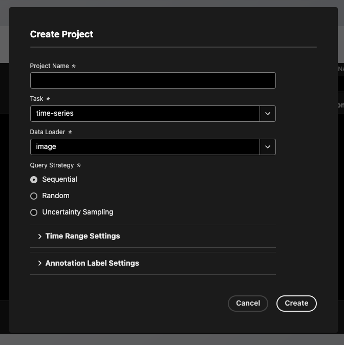
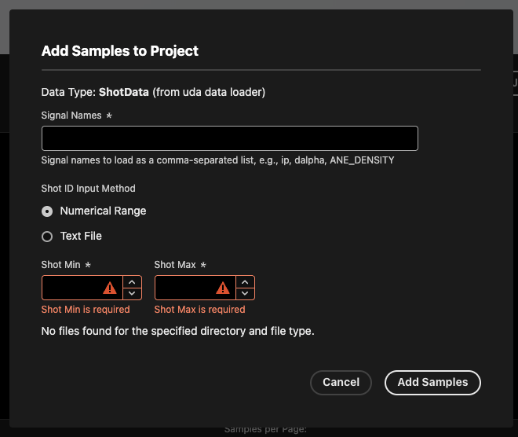

# Creating Projects and Adding Samples

This guide walks you through creating a TokTagger project and adding samples for annotation.

## Creating a Project

A project defines the annotation task, data source, and labeling configuration for a set of samples.

<figure markdown="span">
   { width="500" }
  <figcaption>Creating a new project.</figcaption>
</figure>

1. Navigate to the **Projects** page in the TokTagger UI
2. Click **Create Project**
3. Fill in the required fields:
    - **Name**: A descriptive name for your project (e.g., "Disruption Detection")
    - **Task**: The type of annotation task:
        - `time-series` - Label multi-variate time series signals at specific time points or over time intervals
        - `video` - Frame-by-frame bounding box annotation of video data
    - **Data Loader**: [Where your data comes from:](./data_loaders.md)
        - `uda` - Load signals using UDA (for MAST/MAST-U data)
        - `uda_camera` - Load camera images from UDA (for MAST/MAST-U data)
        - `sal` - Load signals using SAL (for JET data)
        - `fair_mast` - Load signals from the [FAIR-MAST](https://mastapp.site/) data repository
        - `tabular` - Load CSV/TSV/Parquet files from local disk
        - `image` - Load images from local PNG / JPEG files
        - `image-array` - Load Numpy arrays as images from local `.npy` or `.npz` files
    - **Query Strategy**: Navigation strategy to select the next sample to annotate:
        - `sequential` - In order sequentially by shot ID
        - `random` - Random selection
        - `uncertainty` - Prioritize uncertain predictions (requires annotations with a uncertainty score)

4. (Optional) Configure time windows for time-series data:
    - **Time Min**: Start time in seconds (e.g., -0.1)
    - **Time Max**: End time in seconds (e.g., 0.8)
    - **Min Time Step**: Minimum time resolution (e.g., 0.0001) - signals will be resampled to this resolution if they are at higher resolution. This can help with loading performance.

5. (Optional) Configure label options for your task type. Default labels are provided for:
    - **Shot-level labels** - these are labels which apply to the entire shot (e.g., "Disrupted", "ELM-free")
    - **Time-region labels** - labels for regions of time (e.g., "ELM", "L-mode")
    - **Time-point labels** - labels for specific points in time (e.g., "Disruption")
    - **Bounding box labels** - labels for bounding boxes in images
    - **Polygon labels** - labels for polygons in images
    - **Video bounding box labels** - labels for bounding boxes in video frames

6. Click **Create** to finalize the project - you should see a new entry appear in your Projects table.

---

## Adding Samples to a Project

A sample represents a single unit of data to be labeled—typically a tokamak shot, shot subset, or video.

<figure markdown="span">
   { width="500" }
  <figcaption>Adding samples to a project.</figcaption>
</figure>

1. Navigate to your project by clicking on the entry in the Projects table
2. Click **Add Samples**
3. Choose your **Data Input Method**:

**For Signal Data (UDA, SAL, etc.)**

- **Signal Names**: Comma-separated list of signal names to load for annotation (e.g., `ip, ANE_DENSITY, etc.`)
- **Shot ID Input**:
    - **Numerical Range**: Specify a start and end shot ID
    - **Text File**: Upload a `.txt` or `.csv` file with one shot ID per line as the first column (additional columns are ignored)

**For File-Based Data (CSV, Parquet, Image Arrays)**

- **File Type**: Select the file format (`csv`, `parquet`, `json`, etc.)
- **Directory Path**: Path to the directory containing files 
    - Files should be named `{shot_id}.{extension}` (e.g., `100.parquet`)
- **Signal Name(s)**: Comma-separated column names to load. If not specified, loads all columns present in the file. For image arrays loaded from `.npz` files, only one signal name is accepted.

**For Image Data (PNG, JPEG)**

- **Directory Path**: Path containing image subdirectories
    - Images should be organized as `{shot_id}/{image_files}`
    - Image names should be `{frame_id}.{extension}` (e.g., `30421/1.png`)
- **Image Type**: Select the file format (`png` or `jpeg`)

Once finished, click **Create Samples** to add them to the project.

---

## Troubleshooting

**"Signal not available"**: Verify the signal exists in your data repository. Test with UDA directly if using the UDA data loader.

**File path errors**: For file-based data, use absolute paths or paths relative to where the API is running.
