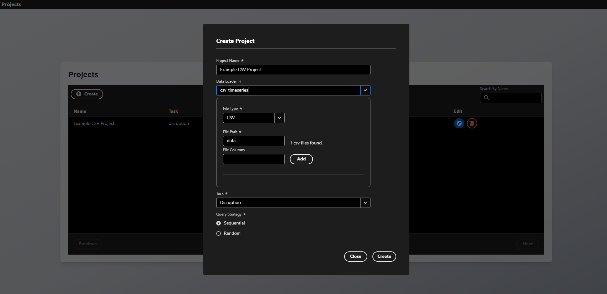
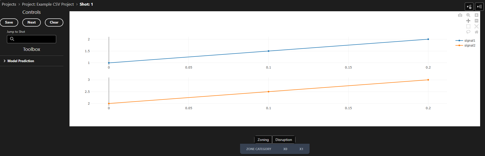

# Custom Data Loaders

Data loaders are the bridge between your data sources and TokTagger's annotation interface. They define how to retrieve and format data for visualization and annotation. TokTagger comes with built-in loaders for common formats (images, Parquet files, UDA), but you can easily create custom loaders for your specific data sources.

## Overview

A data loader is responsible for:

1. **Defining the expected sample data format** (e.g., shot IDs with signal names, file paths)
2. **Retrieving the actual data** from your data source
3. **Converting the data** into TokTagger's standardized format for visualization

## Creating a Custom Data Loader

### Step 1: Import Required Components

```python
from toktagger.api.core.data_loaders import DataLoader, LoaderRegistry
from toktagger.api.schemas.data import Data, MultiVariateTimeSeriesData, TimeSeriesData
from toktagger.api.schemas.samples import ShotData, FileData, TimeSeriesFileData
from typing import Type
import pydantic
```

### Step 2: Define Your Data Loader Class

Create a class that inherits from `DataLoader` and implement the required methods:

```python
@LoaderRegistry.register("my_custom_loader")
class MyCustomLoader(DataLoader):
    """DataLoader for retrieving data from my custom data source"""
    
    def __init__(self, params):
        # Initialize your data source connection here
        # For example: database connection, API client, etc.
        super().__init__(params)
    
    @classmethod
    def sample_data_type(cls) -> Type[ShotData | FileData | TimeSeriesFileData]:
        """Define what type of sample data this loader expects"""
        return ShotData  # or FileData, or TimeSeriesFileData
    
    @pydantic.validate_call
    def get_sample(self, shot_id: int, sample_data: ShotData) -> Data:
        """
        Retrieve and return data for a specific sample.
        
        Args:
            shot_id: Unique identifier for the sample
            sample_data: Sample-specific configuration (signal names, file paths, etc.)
            
        Returns:
            Data object in TokTagger format
        """
        # Your implementation here
        pass
```

### Step 3: Register the Loader

The `@LoaderRegistry.register("my_custom_loader")` decorator automatically registers your loader with TokTagger. The name you provide becomes the identifier used in project configurations.

### Step 4: Run Server with Custom Loader

If you have added your own data loaders, you must make sure they have been loaded before the server is run. You can run the server from within a Python script by initializing the `Server` class, and running `server.run()`. For example, your script for adding a data loader and running the server may look like this:

```python
from toktagger.api.core import DataLoader, LoaderRegistry, Server
from toktagger.api.schemas.samples import Sample
from toktagger.api.schemas.data import TimeSeriesData

# Say we have a python module which can load data from our Tokamak's data backend:
import my_tokamak_data_backend

# Decorate your class using the Loader Registry, 
# providing a string which you want to refer to your data loader as:
@LoaderRegistry.register("my_tokamak")
class MyDataLoader(DataLoader):

    def get_sample(self, sample: Sample) -> TimeSeriesData:
        # Here you add the logic for how to obtain the data for your given sample
        loaded: dict = my_tokamak_data_backend.get(
            shot_id = sample.shot_id, 
            signal_name = sample.signal_names[0]
            )

        # Format it into the Data schema which you want to use
        # For example, if we are loading time series data:
        return TimeSeriesData(
            time=loaded["time"], 
            values=loaded["values"]
            )

# Create and run a server in the same file, 
# so that your data loader is correctly added to the registry:
server = Server()
server.run()
```

## Data Types and Schemas

### Sample Data Types

Choose the appropriate sample data type for your loader:

#### `ShotData`
For shot-based data sources (like UDA, databases):

```python
class ShotData(BaseModel):
    protocol: Literal["uda", "sal"]
    signal_names: list[str]  # List of signals to retrieve
```

**Use when**: Data is identified by shot number and signal names.

#### `FileData`
For file-based data sources (images, videos):

```python
class FileData(BaseModel):
    file_name: str  # Path to file or directory
    type: FileType  # e.g., "png", "jpeg", "mp4"
    protocol: Literal["file", "s3"]  # "file" or "s3"
```

**Use when**: Data is stored in individual files with different types.

#### `TimeSeriesFileData`
For time series files (Parquet, CSV, NetCDF):

```python
class TimeSeriesFileData(FileData):
    signal_names: Optional[list[str]] = None  # Optional signal filter
```

**Use when**: Files contain time series data with multiple signals.

### Return Data Types

Your `get_sample()` method should return one of these data types:

#### `ImageData`
For image-based visualization:

```python
class ImageData(Data):
    frame: int  # Frame number or identifier
    values: str  # Base64-encoded image string
```

#### `TimeSeriesData`
For single signal time series:

```python
class TimeSeriesData(Data):
    time: list[float]  # Time values
    values: list[float]  # Signal values
```

#### `MultiVariateTimeSeriesData`
For multiple signals (most common for fusion diagnostics):

```python
class MultiVariateTimeSeriesData(Data):
    values: dict[str, TimeSeriesData | None]  # Signal name -> data
```

#### `SpectrogramData`
For frequency-time representations:

```python
class SpectrogramData(Data):
    time: list[float]
    frequency: list[float]
    amplitude: list[list[float]]  # 2D array
```


## Complete Example: CSV Time Series Loader

Here's a complete example of a custom loader for CSV time series files:

```python title="loader.py"
import pandas as pd
import pathlib
from typing import Type
import pydantic

from toktagger.api.core.data_loaders import DataLoader, LoaderRegistry
from toktagger.api.schemas.data import MultiVariateTimeSeriesData, TimeSeriesData
from toktagger.api.schemas.samples import Sample, TimeSeriesFileData


@LoaderRegistry.register("csv_timeseries")
class CSVTimeSeriesLoader(DataLoader):
    """DataLoader for retrieving time series data from CSV files"""
    
    @classmethod
    def sample_data_type(cls) -> Type[TimeSeriesFileData]:
        # This loader expects file paths with optional signal names
        return TimeSeriesFileData
    
    @pydantic.validate_call
    def get_sample(
        self, 
        sample: Sample,
        params: DataParams = DataParams(),
    ) -> MultiVariateTimeSeriesData:
        """
        Load time series data from a CSV file.
        
        Expected CSV format:
        - First column: time values
        - Remaining columns: signal values with column headers
        """
        # Verify file exists
        file_path = pathlib.Path(sample.data.file_name)
        if not file_path.exists():
            raise FileNotFoundError(
                f"Could not find CSV file at '{file_path}'"
            )
        
        # Read CSV file
        df = pd.read_csv(file_path, index_col=0)  # First column is time
        
        # Filter to requested signals if specified
        if sample.data.signal_names:
            df = df[sample_data.signal_names]
        
        # Handle missing values
        df = df.fillna(0)
        
        # Extract time values from index
        time = df.index.values.tolist()
        
        # Convert each column to TimeSeriesData format
        results = {}
        for column_name in df.columns:
            results[column_name] = TimeSeriesData(
                time=time,
                values=df[column_name].values.tolist()
            )
        
        return MultiVariateTimeSeriesData(values=results)
```

This examples assumes the CSV file has the following format:

- First column: time values
- Remaining columns: signal values with column headers

The file should be called `{shot_id}.csv`.

For example:

```csv title="1.csv"
time,signal1,signal2
0.0,1.0,2.0
0.1,1.5,2.5
0.2,2.0,3.0
```


### Running the Example
To run the example above and create a custom CSV dataloader:

- Copy the code above into a file called `loader.py`
- Make a file to run the server called `run.py`, which does:

```python title="run.py"
from loader import CSVTimeSeriesLoader
from toktagger.api.main import Server

server = Server()
server.run()
```

- Create a directory which will contain your data called `data`, and then copy the CSV above into a file named `1.csv` within the new directory
- Run `python run.py`
- Open the UI in your browser at `localhost:8002/ui/projects`
- Click the `Create` button on the UI, and click the `Data Loader` dropdown. You should see your new data loader listed there, called `csv_timeseries`.
- After selecting the custom data loader, set the file path as `data` - the UI should tell you that a file has been found within that directory. Fill in the other information, including project name and task as shown below, and press `Create`:



- You should now be able to open the sample which we have created, corresponding to our CSV file. You should see two time series plots containing the data from our CSV file:




## Example: Database Loader

Here's an example of loading data from a SQL database:

### Update Config Settings
If your data loader requires configuration inputs from the user, then the `config.Settings` object should be updated to accept this. This takes the form of a [Pydantic Settings object](https://pydantic.dev/docs/validation/latest/concepts/pydantic_settings/#usage), where nested `BaseModels` represent sections inside the `toktagger.toml` configuration file. For example, we can make create a new Settings object which inherits from the one in `toktagger.api.config.py`, and we can add a new `SQL` section where we need the database URL to connect to with our dataloader:
```python
from toktagger.api.config import Settings

class SQL(pydantic.BaseModel):
    url: str | None = pydantic.Field(
        None,
        description="URL of the SQL database to connect to",
    )
class UpdatedSettings(Settings):
    sql: SQL = pydantic.Field(SQL)
```
Note that this will load settings from the following sources, in the following order:
1. Any values which the `UpdatedSettings` class is initialized with
2. Environment variables, case insensitive, named using the nested model names. Eg for the above setting, it would be `SQL_URL`.
3. Values in the `toktagger.toml` configuration file, with section titles according to nesting. Eg:
```toml
[sql]
url = "sqlite:///./test.db"
```
4. Environment variables provided in a .env file

### Create the DataLoader
We can then create our dataloader, accessing the setting we defined above:
```python
import sqlalchemy as sa
from typing import Type
import pydantic

from toktagger.api.core.data_loaders import DataLoader, LoaderRegistry
from toktagger.api.schemas.data import MultiVariateTimeSeriesData, TimeSeriesData, DataParams
from toktagger.api.schemas.samples import ShotData
import toktagger.api.config as config

@LoaderRegistry.register("sql_database")
class SQLDatabaseLoader(DataLoader):
    """DataLoader for retrieving data from a SQL database"""
    
    def __init__(self):
        # Initialize database connection
        # Connection string should be in the settings object
        self.engine = sa.create_engine(config.settings.sql.url)
    
    @classmethod
    def sample_data_type(cls) -> Type[ShotData]:
        return ShotData
    
    @pydantic.validate_call
    def get_sample(
        self, 
        sample: Sample,
        params: DataParams = DataParams(), 
    ) -> MultiVariateTimeSeriesData:
        """Load time series data from database"""
        results = {}

        with self.engine.connect() as conn:
            for signal_name in sample.data.signal_names:
                # Query time series data for this shot and signal
                query = sa.text("""
                    SELECT time, value 
                    FROM timeseries_data 
                    WHERE shot_id = :shot_id AND signal_name = :signal_name
                    ORDER BY time
                """)
                
                result = conn.execute(
                    query, 
                    {"shot_id": sample.shot_id, "signal_name": signal_name}
                )
                rows = result.fetchall()
                
                if rows:
                    time = [row[0] for row in rows]
                    values = [row[1] for row in rows]
                    results[signal_name] = TimeSeriesData(time=time, values=values)
                else:
                    results[signal_name] = None
        
        return MultiVariateTimeSeriesData(values=results)
```
### Launch the Server
To run the server with our custom Settings object and DataLoader, we should create a run script as follows:
```python title="run.py"
from settings import UpdatedSettings
from loader import CSVTimeSeriesLoader
from toktagger.api.main import Server
import toktagger.api.config as config

# Update config.settings to use our new object
config.settings = UpdatedSettings()

server = Server()
server.run()
```

## Using Docker
If you are using the docker compose option to run the server, you can provide a custom script similar to the one above to add your own data loaders. To do this, create a file similar to the one above, but making sure to pass the following arguments into `server.run()`:

```python
server.run(
    host="0.0.0.0",
    port=8002
)
```

You can then provide the path to your script when running docker compose. For example, say we have the above script in a file called `custom_toktagger.py` - We simply need to add `CUSTOM_SCRIPT=./custom_toktagger.py` before the docker compose command, and a SQL URL as an environment variable:

```sh
CUSTOM_SCRIPT=./custom_toktagger.py SQL_URL=<Your URL> docker compose --env-file .env.dev -f docker-compose.dev.yml up --build
```

!!! tip
    Make sure you provide the **path** to your script, and not a string. 
    
    e.g, provide `CUSTOM_SCRIPT=./custom_toktagger.py`, and **not** `CUSTOM_SCRIPT=custom_toktagger.py`.