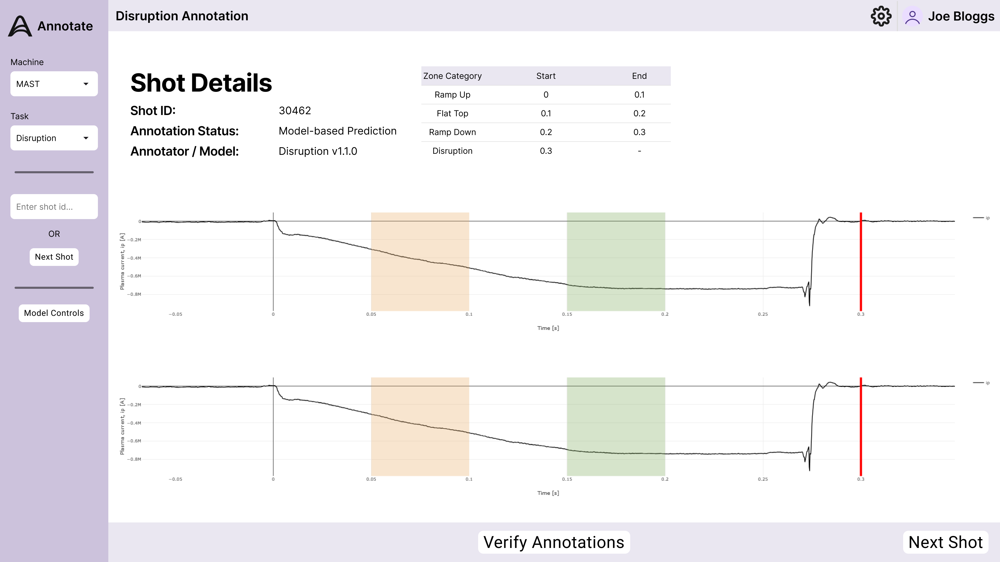

The page outlines the current plans for the user interface using frameworking software. It is broken down into a number of views with discriptions of the functionality and how the UI will interact with the backend API calls.

# Template
This template outlines the basic components that will be consistent across all views in the application.

### Header
The header provides space for the title of the specific view the user is currently working in. This could relate to the task such as disruption annotation or model controls for example. Additionally, space has been allocated for authentication and user controls. It has been discussed within the project that having the ability for people to log into the web application would be beneficial as it means that certain funcitonality could be hidden behind authentication levels. It also opens up the possibility of tracking who generates annotations and the ability to have second reviewers of annotations for example.
### Sidebar
The sidebar is split into three groups of controls. The first group allows for the selection of the machine and the task that the user will be working on. The machines available will be fetched using `/tokamaks` and the tasks available will be selected using `/tokamaks/{tokamak_name}/tasks`

The next group of controls allows users to navigate through shots. The next shot to annotate can either be manually inputted or retrieved from the following endpoint: `/tokamaks/{tokamak_name}/tasks/{task_type}/annotations/next`. Once the target shot ID has been retrieved, `/tokamaks/{tokamak_name}/tasks/{task_type}/data?{shot_id}` can be used to pull the latest data from the database.

# Disruption Annotation
The following framework gives an idea of what the disruption annotation view will look like.

The view provides some basic information regarding the shot that is being worked on. This data is not finalised, but could include what time of annotations are shown (human or model generated) as well as who annotated the data in the case of human annotation or what model version was used. 

The view will also provide the graphs required for performing disruption annotation, with the correct tooling provided (zoning and timepoint annotation). The current annotations are updated live in the table. Once the user is happy with the annotations the validate button can be used to submit the data into the training / validation dataset. This is done though the `/tokamaks/{tokamak_name}/tasks/{task_type}/annotations?{shot_id}'` endpoint, supplying the necessary JSON data as the body.