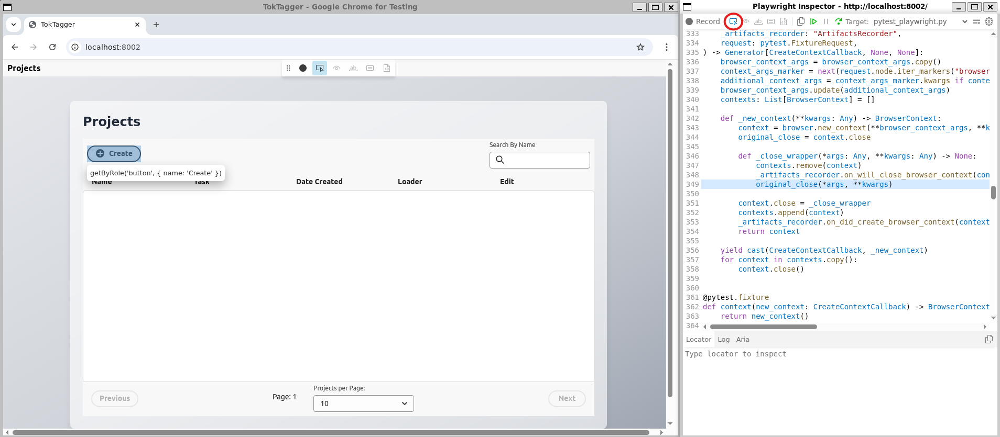

# Unit Tests
Each new feature added to the repository should have unit tests added to ensure that its basic functionality is working as expected. For the backend tests, we use `pytest` for this.

## Running the tests
To run the tests, you need to install the development environment with `uv`:

```
uv venv --python 3.12.6
source .venv/bin/activate
uv sync --all-extras
python -m playwright install --with-deps
pytest
```

The tests check functionality at the following levels:

## API Tests
These tests check the functionality of the backend

### Core code

Tests that functionality such as the annotators, data loaders and query strategies work. These typically use dummy data and do not require an instance of the database to be running.

### Database code

 Tests that the functionality of the MongoDB Client and helper functions work as expected. These require an instance of the database to be running, with set objects automatically instantiated and used to populate the database. A MongoDB docker container is run using `testcontainers` to spin up the database - note that you will need `docker` on your system to use this. 

 The objects which are instantiated for entry into the database are defined inside `tests/db_definitions.py`. Any schema definitions which are reused in multiple tests should be located here. **Be aware that any changes made to these definitions will likely cause other tests to break!**

 To get access to the instance of the `MongoDBClient` to query the database, you should use the fixture `db_client` in your test.

 To add all of the objects defined inside `db_definitions` into the database, use the fixture `setup_db` in your test. This will return you a dictionary of all of the IDs of each object entered into the DB if you need access to these in your tests. All of these objects are automatically cleaned out of the database at teardown of each test.


 You can get a smaller version of the database which is useful for some tests by using the fixture `setup_db_small`. This just instantiates one project, sample and annotation.

### Rest API Code

 Tests are written which check the functionality of each API endpoint. These use a test API client provided by `httpx`. Note that we cannot use `fastapi`'s `TestClient` as this does not work properly in asynchronous mode which is required for the `MongoDBClient` to work.

 To use this, add the fixture `api_client` to your tests. Use this in the same way you would use the `requests` library, eg by using `api_client.post(url=..., json=...)`. This will automatically connect to the database client so that queries work correctly. You can still also use the fixtures `setup_db` or `setup_db_small` to create objects in the database for the API to query.

## End to End Tests
These tests spin up a local instance of the server and UI, and use Playwright to test pressing buttons on the UI has the expected effect. 

### Installing Playwright
We use `playwright-pytest` to write the end to end tests, which is included in the dev dependencies of the package. Before running these tests you will also need to install playwright inside your virtual environment:
```
python -m playwright install --with-deps
```

### Writing Playwright Tests
Since we use `playwright-pytest`, they are written and ran in the same way as any other Pytest unit test. You typically need to chain together a [locator](https://playwright.dev/docs/locators), which tells the test how to find an element on the page, and an [assertion](https://playwright.dev/docs/test-assertions) to check that UI element is in the correct form. Sometimes you may also want to chain a locator together with an [action](https://playwright.dev/docs/input), such as clicking a button or filling in a text box.

Locators typically work by selecting the `role` of an element, and then its `label`. If you find it really difficult to select an element on a webpage with Playwright, this typically indicates an accessibility issue within the code, as someone using a screen reader or other assistive technology will also struggle to navigate the page. A common example of this would be a button with only an icon (no text) which has not been assigned an `aria-label` within the code which describes what it is used for.

When writing a new test, make sure you pass in the fixture `server_setup` (which starts the backend and UI, and clears any entries in the database after your test finishes), and `page: Page` (which is a fixture from Playwright). You will also need to create any database entries which you want to query in your test by making a request to the relevent endpoint using the `request` module. You then need to navigate to the UI page which you want to test on localhost of your machine - eg `page.goto("http://localhost:8002")`.

The easiest way to find which locator you need to use in your test for a given element is to then run this shell of a test in debug mode. To do this, run eg `PWDEBUG=1 pytest -k test_my_new_functionality`. This will open your UI, along with a test debug window where you can step through each line in your test to see Playwright find your locators and perform relevant actions. To find locators, press the 'locator' button (circled in the image below), and then hover your cursor over any UI element to find how to locate it in your test.



Once your test has been written, you can see it running with Playwright identifying and clicking on elements as it goes along by running:

```
pytest -k test_my_new_functionality --headed --browser=chromium --slowmo=3000
```

Once your test is passing, you can just do `pytest` to run the test without seeing it in the browser.

## Models Enabled vs Disabled tests
TokTagger has an optional set of `models` dependencies, which are required to run model training and prediction within the server. The majority of tests are unaffected by this, and can be ran either with the optional dependencies installed or not. However, some of the tests require these optional dependencies to either be present or missing, to check functionality in both cases. To add one of these tests, add the relevant mark:
```py
@pytest.mark.models_enabled
```
or
```py
@pytest.mark.models_disabled
```
There is a fixture which automatically runs on all tests which checks for this mark, checks whether the optional dependencies are installed, and skips the test if those two things are conflicting.

To allow this to work effectively, fixtures written into `conftest.py` or definitions made in `db_definitions.py` should **not** require models to be installed to work. This is because these are automatically loaded for all tests. If you require a fixture which contains model specific code (ie, things which use `ray`, or which define a new model, etc), then it should be defined separately in `models_fixtures.py` or `models_definitions.py`, and then imported into `conftest.py` or `db_definitions.py` with the relevant guard which only imports them if model dependencies are enabled.

If you are writing a full file of tests which should only be ran when the models optional dependencies are present, for example `api/routers/test_models.py`, then you can add the following lines at the very top of the file to skip all subsequent imports and tests if 
the dependencies are missing:
```py
import pytest
pytest.importorskip("ray")
```