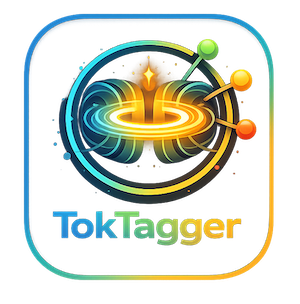

# TokTagger

<figure markdown="span">
    {align=center}
  <figcaption>TokTagger: an open source, interactive annotation platform for Tokamak diagnostic data.</figcaption>
</figure>


TokTagger is a web-based platform for curating labeled datasets from tokamak diagnostics. It lets users browse shots, inspect signals and images, apply consistent labels, and manage annotations in one place. The Python API and React UI support local or team workflows, making it straightforward to create datasets for downstream analysis and machine-learning models.

It currently supports the following features:

- **Data Browsing**: Explore tokamak shots, signals, and images through an intuitive interface.
- **Annotation Tools**: Apply consistent labels to signals and images using a customizable tagging system.
- **ML Models**: Train and infer from ML models within the UI.
- **Dataset Management**: Organize and manage annotations in a central repository.
- **Extensible API**: A Python API for integrating with existing workflows and tools.


## Installation

To run the application locally:

### Install via pip
To install the package via `pip` (or similarly via `Poetry` or `uv` package managers):
```sh
python -m venv .venv
source .venv/bin/activate
```
To install the package for labelling only (without ML Model functionality):
```sh
pip install toktagger
```
Or to include the ML models:
```sh
pip install toktagger[models]
```
If you intend to add custom data loaders or models to your TokTagger instance, this is the recommended route.

### Install as a uv tool
Alternatively, it can be installed as a tool using `uv`. To install the package for labelling only (without ML Model functionality):

```sh
uv tool install --python 3.12.6 toktagger
```
Or to include the ML models:
```sh
uv tool install --python 3.12.6 toktagger[models]
```

## Quick Start
To get started, run:

```sh
toktagger
```

This will start a local instance of the application running at `http://localhost:8002`.

## Configuration
There are a series of additional options which you can configure to customise the functionality of TokTagger - [find details about these here.](./configuration.md)

## Project Links

 - [Git Repo](https://github.com/ukaea/toktagger)
 - [License](https://github.com/ukaea/toktagger/blob/main/LICENSE)
 - [Bug/Issue Tracker](https://github.com/ukaea/toktagger/issues)
 - [Contributing](https://github.com/ukaea/toktagger/blob/main/CONTRIBUTING.md)
 - [Cite](https://github.com/ukaea/toktagger/blob/main/CITATION.cff)
