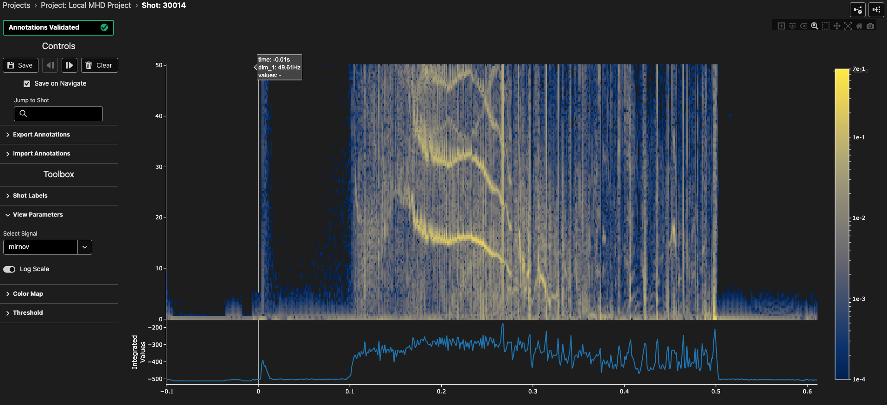

# 2D Profile Labelling Interface

The 2D profile labelling interface is designed for interactive annotation and analysis of two-dimensional tokamak diagnostic data, such as spectrograms, time-frequency representations, or other spatiotemporal measurements. This interface enables you to visualize 2D data as heatmaps, create various types of annotations, and analyze patterns across time and spatial dimensions.

## Overview

<figure markdown="span">
   
  <figcaption>The 2D profile labelling interface showing heatmap and integrated plots with annotations.</figcaption>
</figure>

The 2D profile view displays diagnostic data as a heatmap with time on the horizontal axis and a spatial dimension (e.g., frequency, radius, or position) on the vertical axis. An integrated time series plot below the heatmap shows the sum of values across the spatial dimension, helping identify temporal patterns and events.

## Interface Components

### Plot Area

The main visualization consists of two vertically stacked plots:

- **Heatmap Plot (Top)**: Displays the 2D data with color intensity representing signal amplitude or power. The color scale automatically adjusts based on the data range and can be toggled between linear and logarithmic scaling.
- **Integrated Plot (Bottom)**: Shows the time-integrated values, summed over the spatial dimension. This 1D plot helps identify significant temporal events that may be less obvious in the 2D view.

Both plots share a common time axis, enabling synchronized navigation and analysis.

### Color Scale

The heatmap uses a continuous color scale to represent data values. The colorbar on the right side shows the mapping between colors and values:

- **Linear Scale**: Direct mapping of data values to colors
- **Logarithmic Scale**: Useful for data spanning multiple orders of magnitude, with enhanced visibility of low-amplitude features

**Available Colormaps:**

- Viridis (default)
- Plasma
- Inferno
- Magma
- Cividis

### View Parameters

Access view parameters from the toolbar on the right:

- **Signal Selection**: Choose which diagnostic signal to display when multiple signals are available
- **Log Scale Toggle**: Switch between linear and logarithmic color scaling for better visualization of different dynamic ranges

### Navigation Controls

At the top of the interface, you'll find navigation controls to move through your dataset:

- **Previous Button** (◄): Navigate to the previous sample in your project
- **Next Button** (►): Navigate to the next sample in your project
- **Save Button**: Save your current annotations
- **Delete Button**: Remove selected annotations

**Keyboard Shortcuts:**

- `Shift + ←`: Navigate to previous sample
- `Shift + →`: Navigate to next sample

### Interactive Toolbar

The Plotly toolbar at the top of the plot provides drawing and navigation tools:

- **Draw Rectangle**: Create rectangular bounding box annotations
- **Draw Polygon**: Create freeform polygon annotations
- **Erase Shape**: Remove drawn shapes
- **Zoom**: Box zoom to a region of interest
- **Pan**: Click and drag to pan the view
- **Auto Scale**: Reset axes to show all data
- **Reset View**: Return to the initial view
- **Download Plot**: Export the current view as an image

## Creating Annotations

TokTagger supports multiple annotation types for 2D profile data, each suited to different labeling tasks:

### Time Regions (Zones)

Time regions are vertical bands that mark time intervals of interest. They span the full spatial dimension and are ideal for labeling extended events or operational phases.

**To create a time region:**

1. Right-click on the plot to open the context menu
2. Select "Add Time Region" and choose a category

**Visual appearance:** Time regions appear as semi-transparent colored vertical bands spanning the full height of the heatmap.

**Available categories:**

- ELM (Edge Localized Mode)
- L-mode (Low confinement mode)
- H-mode (High confinement mode)
- Thermal Quench
- Current Quench
- Sawtooth
- IRE (Internal Reconnection Event)
- Locked Mode
- VDE (Vertical Displacement Event)
- Unknown

### Time Points (VSpans)

Time points are vertical lines marking specific moments in time. They are useful for identifying instantaneous events or transitions.

**To create a time point:**

1. Right-click on the plot to open the context menu
2. Select "Add Time Point" and choose a category

**Visual appearance:** Time points appear as vertical colored lines extending through the entire heatmap.

**Available categories:**

- Disruption
- Thermal Quench
- Current Quench
- Control Loss

### Bounding Boxes

Bounding boxes are rectangular regions that mark specific areas in both time and spatial dimensions. They are ideal for identifying localized features or events.

**To create a bounding box:**

1. Click the "Draw Rectangle" button in the Plotly toolbar
2. Click and drag on the heatmap to define the rectangular region
3. The bounding box will be created with the default category

**Visual appearance:** Bounding boxes appear as semi-transparent colored rectangles with visible borders.

**Editing bounding boxes:**

- **Move**: Click and drag the rectangle to reposition it
- **Resize**: Click and drag the edges or corners to adjust the size
- **Delete**: Use the "Erase Shape" tool or the context menu

### Polygons

Polygons allow you to create freeform closed shapes to annotate irregular features or complex spatial patterns.

**To create a polygon:**

1. Click the "Draw Polygon" button in the Plotly toolbar
2. Click on the heatmap to place vertices
3. Double-click or click the starting point to close the polygon

**Visual appearance:** Polygons appear as semi-transparent colored closed shapes following your drawn path.

**Editing polygons:**

- **Move**: Click and drag the polygon to reposition it
- **Reshape**: Click and drag individual vertices to adjust the shape
- **Delete**: Use the "Erase Shape" tool or the context menu

### Masks (Thresholding)

Masks are automatically generated 2D annotations that highlight regions exceeding intensity thresholds. These are created using the automated thresholding tool.

**To create a mask using thresholding:**

1. Open the "Thresholding" panel in the right toolbar
2. Enable the threshold tool with the toggle switch
3. Adjust the parameters:
   - **Percentile**: Set the intensity threshold (0-100)
   - **Frequency Range**: Define the minimum and maximum spatial dimension values to analyze
   - **Sigma**: Gaussian smoothing parameter for noise reduction
   - **Min Size**: Minimum connected region size (in pixels) to keep
   - **Line Filter Width**: Width of horizontal line artifacts to remove
4. Click "Apply" to generate the mask

**Visual appearance:** Masks appear as semi-transparent colored overlays on the heatmap, typically with reduced opacity to allow viewing the underlying data.

## Modifying Annotations

### Selecting Annotations

- **Click** on any annotation to select it
- Selected annotations can be modified or deleted
- For Zones and VSpans, right-click to access the context menu

### Moving and Resizing

**Drawing-based annotations (Polygons and Bounding Boxes):**

- Click and drag to move the entire shape
- Click and drag vertices or edges to reshape
- These annotations use Plotly's built-in shape editing capabilities

**Zones and VSpans:**

- Click and drag to reposition along the time axis
- For Zones, drag the edges to adjust the start or end time

### Changing Categories

To change the category of an existing annotation:

1. Right-click on the annotation (for Zones and VSpans)
2. Select "Change Type" and choose the new category
3. For drawing-based annotations, delete and recreate with the desired category

### Deleting Annotations

**For Zones and VSpans:**

1. Right-click on the annotation
2. Select "Delete" from the context menu

**For Polygons and Bounding Boxes:**

1. Click the "Erase Shape" button in the Plotly toolbar
2. Click on the shape to remove it

Alternatively, select any annotation and click the Delete button in the navigation controls.

## Plot Interaction

### Zooming and Panning

The 2D profile plot supports rich interactive exploration:

- **Box Zoom**: Click the zoom button in the toolbar, then click and drag to select a region to zoom into
- **Pan**: Click the pan button in the toolbar, then click and drag to pan the view
- **Scroll Zoom**: Disabled by default to prevent accidental zooming
- **Reset View**: Click "Reset View" or "Auto Scale" to return to the initial view

### Color Scale Adjustment

- **Linear vs. Log Scale**: Toggle between linear and logarithmic color scaling using the switch in the View Parameters panel
- **Colormap Selection**: Choose from different colormaps in the plot properties settings
- **Automatic Range**: The color scale automatically adjusts to the data range

### Working with the Integrated Plot

The bottom integrated plot provides a 1D time series view:

- Helps identify significant events by showing temporal patterns
- Shares the same time axis as the heatmap for easy correlation
- Updates automatically when zooming or panning the time axis

## Automated Annotation Tools

### Thresholding Tool

The thresholding tool automatically identifies regions in your 2D data that exceed specified intensity criteria. This is particularly useful for:

- Detecting edge localized modes (ELMs) in tokamak spectrograms
- Identifying bursts, instabilities, or other high-intensity events
- Creating initial annotations for further manual refinement

**Parameters:**

- **Percentile**: Sets the intensity threshold as a percentile of the data distribution (e.g., 95 means the top 5% of values)
- **Frequency Range**: Restricts analysis to a specific range of the spatial dimension, useful for excluding noise or irrelevant regions
- **Sigma**: Controls Gaussian smoothing to reduce noise before thresholding
- **Min Size**: Filters out small detected regions below this size threshold
- **Line Filter Width**: Removes horizontal line artifacts that may be present in some diagnostics

**Workflow:**

1. Load your data sample
2. Open the Thresholding panel from the right toolbar
3. Adjust parameters while observing the heatmap (toggle the tool on to see preview)
4. When the threshold opacity overlay shows the desired features, click "Apply"
5. Review and manually edit the generated mask if needed

**Note:** The thresholding tool creates a single mask annotation per sample. Running the tool again will replace the previous mask.
