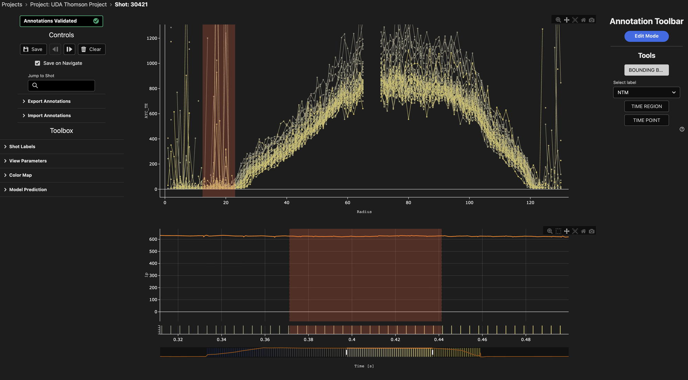

# Radial Profile Labelling Interface

Use the radial profile interface to annotate profile diagnostics, for example Thomson scattering electron temperature (`AYC_TE`) on MAST. The interface shows the profile against radius for each time slice. It also shows time series signals for the same shot.

## Overview

<figure markdown="span">
   
  <figcaption>The radial profile interface. The radial plot shows Thomson scattering electron temperature. The time plot shows plasma current. Both plots show annotations.</figcaption>
</figure>

The interface has two plots:

- **Radial Plot (Top)**: Shows one line for each time slice of the profile signal. The horizontal axis is radius. The colour of each line shows the time of the slice.
- **Time Plot (Bottom)**: Shows the other 1D signals of the sample, for example plasma current. A strip at the bottom of this plot has one marker for each time slice. Each marker has the same colour as its line in the radial plot.

The time plot controls the time window. Zoom or pan the time plot to change the time window. The radial plot then shows only the slices in that window.

## Create a Radial Profile Project

1. Set **Task** to `radial-profile`.
2. Set **Data Loader** to a loader that can return 2D signals, for example `uda`, `sal` or `fair_mast`.
3. Add samples. Each sample must have one or more 2D profile signals. It can also have 1D signals. For example, for MAST Thomson scattering:

    ```json
    {"protocol": "uda", "signal_names": ["AYC_TE", "AYC_R", "ip"]}
    ```

4. Set the **Radial Range Labels** for the radial ranges.

Do not set **Min Time Step** for this task. TokTagger does not interpolate 2D signals, but it does interpolate 1D signals.

## View Parameters

Open **View Parameters** in the toolbox on the left:

- **Profile Signal**: The 2D signal to show in the radial plot. By default, TokTagger uses the first 2D signal of the sample.
- **Radius Signal**: The 2D signal that gives the radius of each channel at each time, for example `AYC_R`. Select **Channel index** to use the second dimension of the profile signal. For `AYC_TE`, the second dimension is the channel number, not the radius. Thus, select `AYC_R` to show the profile against major radius.

Open **Color Map** to change the colours of the time slices.

## Annotations

The radial profile interface has three annotation tools:

| Tool | Plot | Data |
|------|------|------|
| **BOUNDING BOX** (radial range) | Radial plot | A radius range over a time range |
| **TIME REGION** | Time plot | A time range |
| **TIME POINT** | Time plot | One time |

You can use each tool only on its plot. If you try to draw on the incorrect plot, TokTagger shows a message.

### Draw a Radial Range

1. Click the mode button to change to **Edit Mode**.
2. Click **BOUNDING BOX**, then select a label.
3. Zoom the time plot to the time window that the range must cover.
4. Hold `Ctrl` and drag across the radial plot to set the radius range.

The time range of the new radial range is the current time window. The radial range shows as a band in the radial plot and as a dashed band in the time plot.

### Edit a Radial Range

In **Edit Mode**:

- Drag the edges of the band in the radial plot to change the radius range.
- Drag the edges of the dashed band in the time plot to change the time range.
- Drag the centre of a band to move it.
- Right-click a band to change its label or to delete it.

The radial plot shows a radial range only when its time range overlaps the time window.

### Storage

TokTagger stores a radial range as a `bounding_box` annotation, where `x` is time and `y` is radius. The `signal_name` of the annotation is the profile signal. Thus, you can use the same annotations in a `profile-2d` project for the same signal.

## Navigation

The navigation controls, keyboard shortcuts and the annotations table are the same as in the [time series interface](time_series.md).
