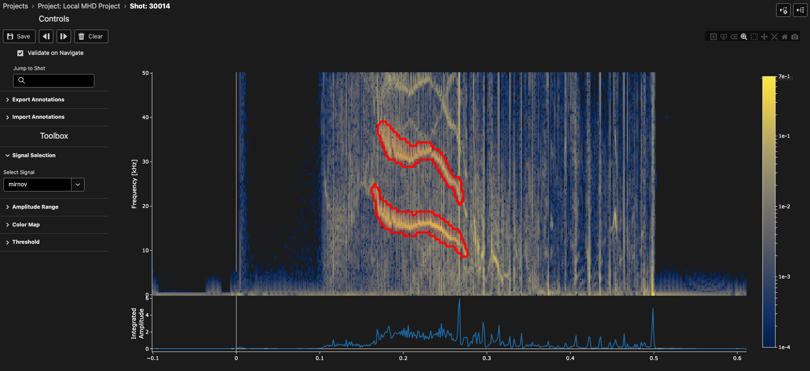

# Spectrogram Labelling Interface

The spectrogram labelling interface is a specialized UI in TokTagger for interactive analysis and annotation of frequency-domain tokamak diagnostic data. This interface allows you to visualize spectral content over time, identify coherent modes, and annotate frequency-based phenomena in your plasma diagnostic signals.

## Overview

<figure markdown="span">
   
  <figcaption>The spectrogram labelling interface showing time-frequency data with annotations.</figcaption>
</figure>

The spectrogram view displays time-frequency data as a 2D heatmap, with time on the x-axis, frequency on the y-axis, and amplitude represented by color intensity. This layout enables you to identify and track frequency-domain features such as MHD modes, sawteeth, and other coherent oscillations in your diagnostic signals.

## Interface Components

### Plot Area

The main plot area consists of two vertically-stacked subplots:

- **Time-Integrated Amplitude Plot** (top 20%): Shows the total spectral power integrated across all frequencies as a function of time. This provides a quick overview of when high-frequency activity occurs.
- **Spectrogram Plot** (bottom 80%): Displays the full time-frequency heatmap with:
  - **X-axis**: Time in seconds
  - **Y-axis**: Frequency in kHz
  - **Color**: Amplitude on a logarithmic scale, with customizable color maps

### Navigation Controls

At the top of the interface, you'll find navigation controls to move through your dataset:

- **Previous Button** (◄): Navigate to the previous sample in your project
- **Next Button** (►): Navigate to the next sample in your project  
- **Save Button**: Save your current annotations
- **Delete Button**: Remove selected annotations

**Keyboard Shortcuts:**

- `Shift + ←`: Navigate to previous sample
- `Shift + →`: Navigate to next sample

### Sample Information

The interface displays the current sample ID and project information, helping you keep track of which data you're annotating.

## Signal Selection

The spectrogram interface requires you to select which diagnostic signal to analyze:

**To select a signal:**

1. Open the "Signal Selection" panel in the toolbar
2. Choose from the available signals in the dropdown menu
3. The spectrogram will automatically update to display the selected signal

The spectrogram is computed using a Short-Time Fourier Transform (STFT) with configurable parameters.

## Visualization Controls

### Amplitude Range

Control the displayed amplitude range to enhance visibility of specific features:

**To adjust amplitude range:**

1. Open the "Amplitude Range" panel in the toolbar
2. Use the dual slider to set minimum and maximum amplitude values
3. Values are displayed on a logarithmic scale to accommodate the wide dynamic range of spectral data

**Note:** The amplitude scale is logarithmic, allowing you to visualize both weak and strong spectral features simultaneously.

### Color Map Selection

Choose from various perceptually-uniform color maps to optimize visualization:

**Available color maps:**

- **Viridis**: Default option, good general-purpose colormap
- **Plasma**: High contrast, emphasizes mid-range values
- **Inferno**: Warm colors, good for presentations
- **Magma**: Similar to Inferno with slightly different hue progression
- **Cividis**: Optimized for color-vision deficiency

**To change the color map:**

1. Open the "Color Map" panel in the toolbar
2. Select your preferred color map from the dropdown menu
3. The spectrogram will update immediately

## Creating Annotations

TokTagger supports multiple annotation types for spectrogram data:

### Time Regions (Zones)

Time regions span a time interval across all frequencies. They are ideal for labelling extended periods of specific MHD activity.

**To create a time region:**

1. Right-click anywhere on the spectrogram to open the context menu
2. Select "Add Time Region" and choose a category (e.g., "NTM", "LLM", "Sawteeth")
3. Alternatively, click and drag horizontally across the plot to create a time region interactively

**Visual appearance:** Time regions appear as semi-transparent colored rectangles spanning the full height of the spectrogram. The color corresponds to the category assigned.

**Available categories:**

- NTM (Neoclassical Tearing Mode)
- LLM (Locked Mode)
- Sawteeth

### Time Points (VSpans)

Time points mark specific moments in time with a vertical line. They are useful for identifying instantaneous events or transitions in MHD activity.

**To create a time point:**

1. Right-click anywhere on the spectrogram to open the context menu
2. Select "Add Time Point" and choose a category (e.g., "Mode Locked")

**Visual appearance:** Time points appear as vertical colored lines extending through the spectrogram.

**Available categories:**

- Mode Locked

### Polygons

Polygons allow you to outline irregular frequency-time regions, perfect for tracking modes that drift in frequency or have complex shapes.

**To create a polygon:**

1. Click the "Draw Closed Path" button in the plot toolbar
2. Click multiple points to define the polygon vertices
3. Double-click or click the first point again to close the polygon
4. Right-click on the polygon to assign it a category

**Visual appearance:** Polygons appear as outlined shapes with semi-transparent fill, conforming to the exact time-frequency region you drew.

### Bounding Boxes (Rectangles)

Bounding boxes are rectangular regions that can span specific time and frequency ranges, ideal for labelling coherent modes with well-defined frequency bands.

**To create a bounding box:**

1. Click the "Draw Rectangle" button in the plot toolbar
2. Click and drag to define the rectangular region
3. Right-click on the rectangle to assign it a category

**Visual appearance:** Bounding boxes appear as rectangular outlines with semi-transparent fill.

## Modifying Annotations

### Selecting Annotations

- **Click** on any annotation to select it
- Selected annotations appear with increased opacity and can be modified

### Moving Annotations

- **Time Regions**: Click and drag the body of a time region to move it horizontally along the time axis
- **Time Points**: Click and drag the vertical line to reposition it
- **Polygons/Bounding Boxes**: Click and drag to reposition the entire shape

### Resizing Time Regions

Time regions have resize handles on their left and right edges:

1. Hover over the left or right edge of a time region until the cursor changes
2. Click and drag the edge to adjust the start or end time

### Editing Shapes

For polygons and bounding boxes, use the "Edit Shape" mode:

1. Select the shape you want to edit
2. Click the "Edit Shape" button in the plot toolbar
3. Drag vertices to modify the shape
4. Click elsewhere to finish editing

### Changing Categories

To change the category of an existing annotation:

1. Right-click on the annotation to open its context menu
2. Select "Change Type" and choose the new category

### Deleting Annotations

To remove an annotation:

1. Click the "Erase Shape" button in the plot toolbar
2. Click on the annotation you want to delete

Alternatively:
1. Right-click on the annotation to open its context menu
2. Select "Delete" from the context menu

## Plot Interaction

### Zooming and Panning

The spectrogram plot supports interactive zooming and panning:

- **Zoom**: Click the "Zoom" button in the plot toolbar, then click and drag to zoom into a region
- **Pan**: Click the "Pan" button in the plot toolbar, then click and drag to pan the view
- **Select**: Use the "Box Select" or "Lasso Select" tools to select multiple annotations
- **Auto Scale**: Click "Autoscale" to reset axes to show all data
- **Reset**: Click "Reset axes" to return to the original view

**Note:** The frequency axis is fixed by the STFT parameters and does not zoom beyond the computed frequency range.

### Disabling Interactions

When holding the **Alt** (or **Option**) key:

- All annotation interactions are temporarily disabled
- This allows you to zoom and pan the plot without accidentally selecting or moving annotations

## Automated Annotation Tools

### Spectrogram Thresholding

The threshold tool automatically detects regions of high spectral power, useful for identifying coherent modes:

**To use the threshold tool:**

1. Open the "Spectrogram Thresholding" panel in the toolbar
2. Enable the tool with the toggle switch
3. Adjust the parameters:
   - **Percentile**: Sets the amplitude threshold (higher = only strongest features)
   - **Frequency Range**: Limits detection to specific frequency bands
   - **Sigma**: Controls Gaussian filtering for noise reduction
   - **Min Size**: Minimum area (in pixels) for detected regions
   - **Vertical Line Filter Width**: Removes narrow vertical artifacts

4. The tool will generate polygon or bounding box annotations for detected regions
5. Fine-tune parameters until you achieve desired detection sensitivity

**Visual feedback:** When the threshold tool is active, regions above the threshold are highlighted, while regions below appear dimmed (40% opacity).