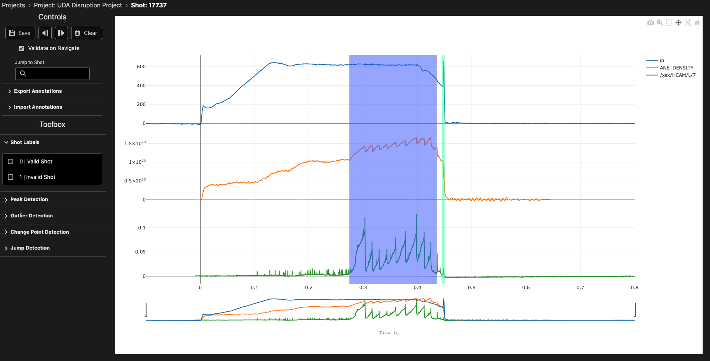

# Time Series Labelling Interface

The time series labelling interface is a core UI in TokTagger, designed for interactive labelling and analysis of multi-variate tokamak diagnostic data. This interface allows you to visualize signals, create annotations, and navigate through your dataset efficiently.

## Overview

<figure markdown="span">
   
  <figcaption>The time series labelling interface showing multi-variate time series data with annotations.</figcaption>
</figure>

The time series view displays multiple diagnostic signals stacked vertically, each with its own y-axis, sharing a common time axis. This layout enables you to visualize correlations between different signals and identify important events across multiple diagnostics simultaneously.

## Interface Components

### Plot Area

The main plot area displays your time series data as line plots. Each signal occupies its own subplot with:

- **Independent Y-axis**: Each signal has its own vertical scale, optimized for its value range
- **Shared X-axis**: All signals share the same time axis at the bottom, measured in seconds
- **Range Slider**: A range slider below the time axis allows quick navigation and zooming to specific time windows

### Navigation Controls

At the top of the interface, you'll find navigation controls to move through your dataset:

- **Previous Button** (◄): Navigate to the previous sample in your project
- **Next Button** (►): Navigate to the next sample in your project  
- **Save Button**: Save your current annotations
- **Delete Button**: Remove selected annotations

**Keyboard Shortcuts:**

- `Shift + ←`: Navigate to previous sample
- `Shift + →`: Navigate to next sample

### Sample Information

The interface displays the current sample ID and project information, helping you keep track of which data you're annotating.

## Creating Annotations

TokTagger supports two primary types of annotations for time series data:

### Time Regions (Zones)

Time regions are rectangular annotations that span a time interval and cover all signal values. They are ideal for labelling extended events or operational phases.

**To create a time region:**

1. Right-click anywhere on the plot to open the context menu
2. Select "Add Time Region" and choose a category (e.g., "ELM", "L-mode", "H-mode")
3. Alternatively, click and drag horizontally across the plot to create a time region interactively

**Visual appearance:** Time regions appear as semi-transparent colored rectangles spanning the full height of all subplots. The color corresponds to the category assigned.

**Available categories:**

- ELM
- L-mode  
- H-mode
- Thermal Quench
- Current Quench
- Sawtooth
- IRE (Internal Reconnection Event)
- Locked Mode
- VDE (Vertical Displacement Event)
- Unknown

### Time Points (VSpans)

Time points are vertical line annotations marking specific moments in time. They are useful for identifying instantaneous events or transitions.

**To create a time point:**

1. Right-click anywhere on the plot to open the context menu
2. Select "Add Time Region" and choose a category (e.g., "Disruption", "Thermal Quench")

**Visual appearance:** Time points appear as vertical colored lines extending through all subplots.

**Available categories:**

- Disruption
- Thermal Quench
- Current Quench
- Control Loss

## Modifying Annotations

### Selecting Annotations

- **Click** on any annotation to select it
- Selected annotations appear with increased opacity and can be modified

### Moving Annotations

- **Time Regions**: Click and drag the body of a time region to move it horizontally along the time axis
- **Time Points**: Click and drag the vertical line to reposition it

### Resizing Time Regions

Time regions have resize handles on their left and right edges:

1. Hover over the left or right edge of a time region until the cursor changes
2. Click and drag the edge to adjust the start or end time

**Minimum width:** Time regions have a minimum width of 0.1% of the current visible time range to ensure they remain visible and selectable.

### Changing Categories

To change the category of an existing annotation:

1. Right-click on the annotation to open its context menu
2. Select "Change Type" and choose the new category

### Deleting Annotations

To remove an annotation:

1. Right-click on the annotation to open its context menu
2. Select "Delete" from the context menu

Alternatively, select the annotation and press the Delete button in the navigation controls.

## Plot Interaction

### Zooming and Panning

The time series plot supports interactive zooming and panning:

- **Pan**: Click and drag on the plot background to pan horizontally
- **Zoom**: Use the range slider at the bottom to zoom into specific time windows
- **Reset**: Double-click on the plot to reset the view to show all data

**Note:** Y-axes have fixed ranges and do not zoom, ensuring consistent signal scaling.

### Disabling Interactions

When holding the **Alt** (or **Option**) key:

- All annotation interactions are temporarily disabled
- This allows you to zoom and pan the plot without accidentally selecting or moving annotations

## Working with Multiple Signals

The time series interface automatically arranges multiple diagnostic signals in a stacked layout:

- Each signal occupies an equal vertical space
- Signals are synchronized along the time axis
- Annotations span across all signals, making it easy to see temporal relationships

Common multi-signal workflows:

1. **Identifying correlations**: Look for simultaneous changes across different diagnostics
2. **Event detection**: Use one signal to identify events (e.g., D-alpha for ELMs) and verify with others
3. **Phase labelling**: Label operational phases visible across multiple diagnostics

## Automated Annotation Tools

For faster annotation, use the automated [annotators](annotators.md) to detect patterns in your signals:

- **Peak Detection**: Identify sharp peaks in signals (useful for ELMs)
- **Change Point Detection**: Detect transitions between operational phases
- **Jump Detection**: Find discontinuities (useful for sawteeth)
- **Outlier Detection**: Identify anomalous data points

See the [Annotators guide](annotators.md) for detailed information on each tool.
