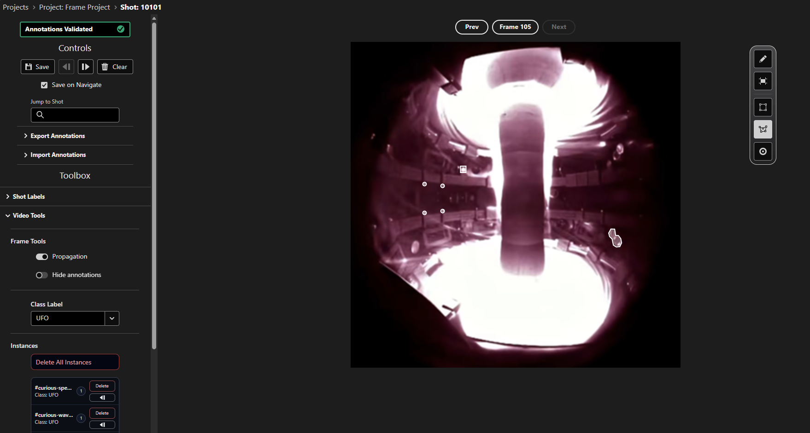

# Video Labelling Interface

The video labelling interface is designed for annotating video data with points, bounding boxes or polygons. This interface allows you to visualize camera data from a Tokamak, create annotations, and navigate through frames & samples efficiently.

## Overview

<figure markdown="span">
   
  <figcaption>The video labelling interface showing a number of bounding box annotations on MAST camera data.</figcaption>
</figure>

For a given sample, the video UI allows you to cycle through different frames of the video, and make annotations. Annotations can be automatically propogated between adjacent frames, for the tracking of transient phenomena.

The interface supports three types of annotations:

- **Bounding Box**: A rectangular box, whose position, height and width are recorded.
- **Polygon**: An abstract, closed shape made up of multiple points. The position of each point is recorded.
- **Point**: Single point annotations, with no size attached. The coordinates of the point are recorded.

The interface has two modes. You can move around your image and inspect existing annotations in View mode, and create / edit annotations in Edit mode.

## Interface Components

### Frame Controls
At the top of the interface, the frame which you are currently viewing is shown. You can step through different frames of camera data for the current sample:

- **Previous Button**: Move to the previous frame, if available
- **Next Button**: Move to the next frame, if available
- **Jump to Frame**: Click on the frame number, and then enter a frame number which you would like to jump to, if available.

### Right Toolbar
On the right hand side of the image, there is a toolbar which controls the mode which you are in, and the type of annotation you wish to create. From top to bottom, the buttons control:

- **Mode**: The mode which you are in, either View (default) or Edit. While in View mode, hold the Shift key to enter Edit mode temporarily.
- **Reset View**: Reset the image to the default zoom level, and centre the image within the window.
- **Bounding Box**: Select the bounding box annotation type, which will be used when you next create an annotation.
- **Polygon**: Select the polygon annotation type.
- **Point**: Select the point annotation type.

### Navigation Controls

In the top left of the interface, you'll find navigation controls to move through your dataset:

- **Previous Button** (◄): Navigate to the previous sample in your project
- **Next Button** (►): Navigate to the next sample in your project  
- **Save Button**: Save your current annotations
- **Clear Button**: Remove selected annotations, and mark annotations in the database as not validated
- **Save On Navigate**: Whether to automatically save any annotations to the database when you move to a different sample
- **Jump to Shot**: Jump to a sample with a given shot ID

### Video Tools
In the left toolbar, you'll find a Video Tools collapsible section. This section contains:

- **Propogation toggle**: Whether to propogate all annotations created on one frame onto the next frame automatically - useful for tracking positions of transient phenomena across adjacent frames.
- **Hide Annotations toggle**: Allows you to temporarily hide annotations from the image - useful to see the image underneath an annotation to check if it is accurate.
- **Class label**: The label to associate with the next annotation that is drawn. This can also be edited by right clicking on the image and selecting a new label from the menu.

#### Instances List 
The instances list within the video tools lets you interact with different annotations. You can:

- **Click on an annotation** in the list to highlight that annotation on the image, if it is present in the current frame.
- **Delete**: Delete a given annotation across all frames where it is present.
- **Jump to Frame**: Jump to the first frame where this annotation is present.
- **Delete All Instances**: Delete all annotations across all frames.

**Keyboard Shortcuts:**

- `Hold Shift`: Enter Edit mode
- `Shift + ←`: Navigate to previous sample
- `Shift + →`: Navigate to next sample

## Create Annotations

### View Mode
By default you are in View mode, where you can:

- Click and drag on the image to move it
- Use the scroll wheel to zoom in/out of the image
- Select an annotation to view information about it
- Reset the position / zoom of the image by pressing the reset view button in the right hand toolbar (second button down).

### Edit Mode
You can enter Edit mode by either clicking the pencil icon in the left hand toolbar, or enter it temporarily by holding the Shift key. Within Edit mode, you can select any of the following annotation types by clicking on the relevant icon in the right hand toolbar:

* **Bounding Box**: Click and drag to draw a rectangular box.
* **Polygon**: Click and drag to draw a line between the first two points in the polygon, and release to place the point. Then click in the next location to place the next point. Finish the polygon by clicking back on the first point you placed.
* **Point**: Click on the image to place a point. These have no size component attached to them - the coordinates of the centre of the dot is recorded as a point.

## Edit Annotations
To edit an existing annotation, make sure that you are in Edit mode, and then select an instance of an annotation on the image. This should open a popup which gives information about that annotation. From there, you can click and drag on the annotation to move its position. You can also edit the size or shape of some types of annotation:

- **Bounding Box**: Click and drag on the corners of the box to resize it.
- **Polygon**: Click and drag on any of the points which make up the polygon to change the shape of the polygon.

## Delete Annotations
To delete a single instance of an annotation in a specific frame, click on that annotation and then press the 'Delete' button in the popup which appears. 

To delete all instances of an annotation, or to delete all instances of all annotations, use the `Instances` list within the `Video Tools` in the left hand toolbar.

## Import / Export Annotations
In the left hand toolbar, there are dropdowns which allow you to either import or export sets of annotations from the selected sample. 

If importing annotations, upload a JSON file with a set of annotations which correspond to the schemas expected for video data (`VideoBoundingBox`, `VideoPolygon`, or `VideoPoint`, [find their definitions here.](https://github.com/ukaea/toktagger/blob/dev/toktagger/api/schemas/annotations.py#L53)). 

If exporting annotations, a JSON file containing all of the annotations in the above schema formats will be downloaded to your computer. You can choose whether to export all annotations for all samples within your project, or just from the current sample.